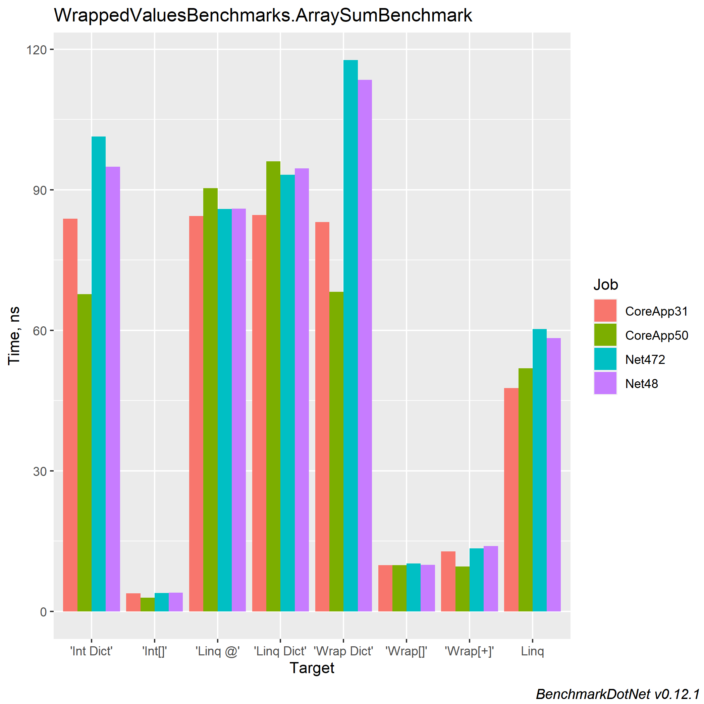

``` ini

BenchmarkDotNet=v0.12.1, OS=Windows 10.0.19041.804 (2004/?/20H1)
Intel Core i9-9900K CPU 3.60GHz (Coffee Lake), 1 CPU, 16 logical and 8 physical cores
.NET Core SDK=5.0.103
  [Host]    : .NET Core 5.0.3 (CoreCLR 5.0.321.7212, CoreFX 5.0.321.7212), X64 RyuJIT
  CoreApp31 : .NET Core 3.1.12 (CoreCLR 4.700.21.6504, CoreFX 4.700.21.6905), X64 RyuJIT
  CoreApp50 : .NET Core 5.0.3 (CoreCLR 5.0.321.7212, CoreFX 5.0.321.7212), X64 RyuJIT
  Net472    : .NET Framework 4.8 (4.8.4300.0), X64 RyuJIT
  Net48     : .NET Framework 4.8 (4.8.4300.0), X64 RyuJIT

IterationCount=10  

```
|      Method |       Job |       Runtime |       Mean |     Error |    StdDev | Ratio | RatioSD |     Rank |
|------------ |---------- |-------------- |-----------:|----------:|----------:|------:|--------:|---------:|
|    &#39;Wrap[]&#39; | CoreApp31 | .NET Core 3.1 |   9.854 ns | 0.0902 ns | 0.0537 ns |  2.56 |    0.02 |       ** |
|     &#39;Int[]&#39; | CoreApp31 | .NET Core 3.1 |   3.840 ns | 0.0200 ns | 0.0132 ns |  1.00 |    0.00 |        * |
|   &#39;Wrap[+]&#39; | CoreApp31 | .NET Core 3.1 |  12.777 ns | 0.0983 ns | 0.0650 ns |  3.33 |    0.03 |      *** |
| &#39;Wrap Dict&#39; | CoreApp31 | .NET Core 3.1 |  83.101 ns | 3.4706 ns | 2.2956 ns | 21.64 |    0.61 |    ***** |
|  &#39;Int Dict&#39; | CoreApp31 | .NET Core 3.1 |  83.849 ns | 4.5561 ns | 3.0136 ns | 21.83 |    0.78 |    ***** |
|        Linq | CoreApp31 | .NET Core 3.1 |  47.691 ns | 0.1838 ns | 0.0961 ns | 12.41 |    0.02 |     **** |
|    &#39;Linq @&#39; | CoreApp31 | .NET Core 3.1 |  84.397 ns | 0.6163 ns | 0.3223 ns | 21.96 |    0.11 |    ***** |
| &#39;Linq Dict&#39; | CoreApp31 | .NET Core 3.1 |  84.574 ns | 0.5282 ns | 0.3143 ns | 22.00 |    0.11 |    ***** |
|             |           |               |            |           |           |       |         |          |
|    &#39;Wrap[]&#39; | CoreApp50 | .NET Core 5.0 |   9.827 ns | 0.0752 ns | 0.0448 ns |  3.39 |    0.02 |      *** |
|     &#39;Int[]&#39; | CoreApp50 | .NET Core 5.0 |   2.897 ns | 0.0233 ns | 0.0154 ns |  1.00 |    0.00 |        * |
|   &#39;Wrap[+]&#39; | CoreApp50 | .NET Core 5.0 |   9.567 ns | 0.0558 ns | 0.0369 ns |  3.30 |    0.02 |       ** |
| &#39;Wrap Dict&#39; | CoreApp50 | .NET Core 5.0 |  68.187 ns | 0.1473 ns | 0.0876 ns | 23.53 |    0.12 |    ***** |
|  &#39;Int Dict&#39; | CoreApp50 | .NET Core 5.0 |  67.703 ns | 0.3772 ns | 0.2495 ns | 23.37 |    0.17 |    ***** |
|        Linq | CoreApp50 | .NET Core 5.0 |  51.863 ns | 2.2311 ns | 1.4757 ns | 17.90 |    0.49 |     **** |
|    &#39;Linq @&#39; | CoreApp50 | .NET Core 5.0 |  90.355 ns | 4.8587 ns | 3.2137 ns | 31.19 |    1.08 |   ****** |
| &#39;Linq Dict&#39; | CoreApp50 | .NET Core 5.0 |  96.065 ns | 4.0599 ns | 2.6854 ns | 33.16 |    0.94 |  ******* |
|             |           |               |            |           |           |       |         |          |
|    &#39;Wrap[]&#39; |    Net472 |    .NET 4.7.2 |  10.181 ns | 0.2483 ns | 0.1299 ns |  2.60 |    0.04 |       ** |
|     &#39;Int[]&#39; |    Net472 |    .NET 4.7.2 |   3.915 ns | 0.0438 ns | 0.0289 ns |  1.00 |    0.00 |        * |
|   &#39;Wrap[+]&#39; |    Net472 |    .NET 4.7.2 |  13.395 ns | 0.1985 ns | 0.1038 ns |  3.43 |    0.04 |      *** |
| &#39;Wrap Dict&#39; |    Net472 |    .NET 4.7.2 | 117.670 ns | 4.5721 ns | 2.7208 ns | 30.06 |    0.85 | ******** |
|  &#39;Int Dict&#39; |    Net472 |    .NET 4.7.2 | 101.365 ns | 5.1877 ns | 3.4313 ns | 25.89 |    0.88 |  ******* |
|        Linq |    Net472 |    .NET 4.7.2 |  60.239 ns | 2.6077 ns | 1.5518 ns | 15.39 |    0.46 |     **** |
|    &#39;Linq @&#39; |    Net472 |    .NET 4.7.2 |  85.867 ns | 0.3910 ns | 0.2586 ns | 21.94 |    0.17 |    ***** |
| &#39;Linq Dict&#39; |    Net472 |    .NET 4.7.2 |  93.196 ns | 0.6175 ns | 0.4084 ns | 23.81 |    0.26 |   ****** |
|             |           |               |            |           |           |       |         |          |
|    &#39;Wrap[]&#39; |     Net48 |      .NET 4.8 |   9.895 ns | 0.0902 ns | 0.0537 ns |  2.49 |    0.06 |       ** |
|     &#39;Int[]&#39; |     Net48 |      .NET 4.8 |   3.977 ns | 0.1823 ns | 0.1085 ns |  1.00 |    0.00 |        * |
|   &#39;Wrap[+]&#39; |     Net48 |      .NET 4.8 |  13.927 ns | 1.0694 ns | 0.7073 ns |  3.49 |    0.24 |      *** |
| &#39;Wrap Dict&#39; |     Net48 |      .NET 4.8 | 113.468 ns | 0.3367 ns | 0.1761 ns | 28.57 |    0.79 |  ******* |
|  &#39;Int Dict&#39; |     Net48 |      .NET 4.8 |  94.912 ns | 1.6322 ns | 1.0796 ns | 23.91 |    0.73 |   ****** |
|        Linq |     Net48 |      .NET 4.8 |  58.323 ns | 0.3934 ns | 0.2341 ns | 14.67 |    0.36 |     **** |
|    &#39;Linq @&#39; |     Net48 |      .NET 4.8 |  85.964 ns | 0.3201 ns | 0.1674 ns | 21.64 |    0.60 |    ***** |
| &#39;Linq Dict&#39; |     Net48 |      .NET 4.8 |  94.577 ns | 1.6347 ns | 0.8550 ns | 23.81 |    0.78 |   ****** |


