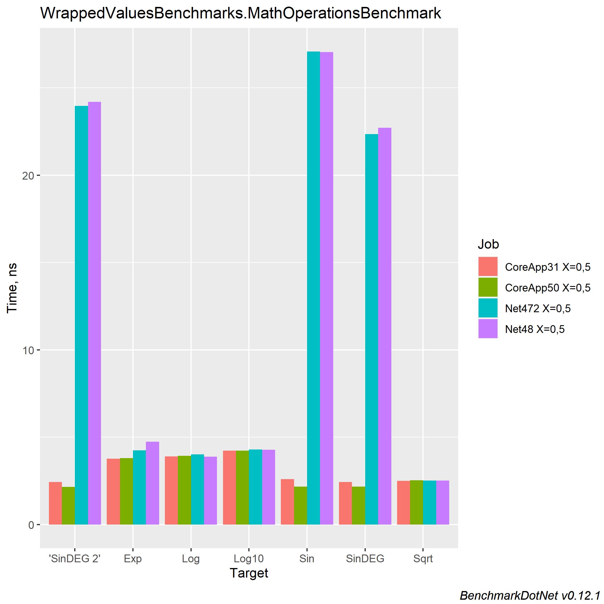

``` ini

BenchmarkDotNet=v0.12.1, OS=Windows 10.0.19041.804 (2004/?/20H1)
Intel Core i9-9900K CPU 3.60GHz (Coffee Lake), 1 CPU, 16 logical and 8 physical cores
.NET Core SDK=5.0.103
  [Host]    : .NET Core 5.0.3 (CoreCLR 5.0.321.7212, CoreFX 5.0.321.7212), X64 RyuJIT
  CoreApp31 : .NET Core 3.1.12 (CoreCLR 4.700.21.6504, CoreFX 4.700.21.6905), X64 RyuJIT
  CoreApp50 : .NET Core 5.0.3 (CoreCLR 5.0.321.7212, CoreFX 5.0.321.7212), X64 RyuJIT
  Net472    : .NET Framework 4.8 (4.8.4300.0), X64 RyuJIT
  Net48     : .NET Framework 4.8 (4.8.4300.0), X64 RyuJIT

IterationCount=10  

```
|     Method |       Job |       Runtime |   X |      Mean |     Error |    StdDev |          Rank |
|----------- |---------- |-------------- |---- |----------:|----------:|----------:|--------------:|
|        Sin | CoreApp31 | .NET Core 3.1 | 0.5 |  2.589 ns | 0.0238 ns | 0.0158 ns |          **** |
|     SinDEG | CoreApp31 | .NET Core 3.1 | 0.5 |  2.431 ns | 0.0238 ns | 0.0157 ns |            ** |
| &#39;SinDEG 2&#39; | CoreApp31 | .NET Core 3.1 | 0.5 |  2.435 ns | 0.0296 ns | 0.0176 ns |            ** |
|       Sqrt | CoreApp31 | .NET Core 3.1 | 0.5 |  2.490 ns | 0.0165 ns | 0.0109 ns |           *** |
|        Exp | CoreApp31 | .NET Core 3.1 | 0.5 |  3.774 ns | 0.0209 ns | 0.0110 ns |         ***** |
|        Log | CoreApp31 | .NET Core 3.1 | 0.5 |  3.893 ns | 0.0206 ns | 0.0136 ns |        ****** |
|      Log10 | CoreApp31 | .NET Core 3.1 | 0.5 |  4.234 ns | 0.0631 ns | 0.0330 ns |      ******** |
|        Sin | CoreApp50 | .NET Core 5.0 | 0.5 |  2.174 ns | 0.0395 ns | 0.0261 ns |             * |
|     SinDEG | CoreApp50 | .NET Core 5.0 | 0.5 |  2.168 ns | 0.0145 ns | 0.0086 ns |             * |
| &#39;SinDEG 2&#39; | CoreApp50 | .NET Core 5.0 | 0.5 |  2.155 ns | 0.0324 ns | 0.0214 ns |             * |
|       Sqrt | CoreApp50 | .NET Core 5.0 | 0.5 |  2.523 ns | 0.0148 ns | 0.0098 ns |           *** |
|        Exp | CoreApp50 | .NET Core 5.0 | 0.5 |  3.806 ns | 0.0214 ns | 0.0141 ns |         ***** |
|        Log | CoreApp50 | .NET Core 5.0 | 0.5 |  3.923 ns | 0.0357 ns | 0.0186 ns |        ****** |
|      Log10 | CoreApp50 | .NET Core 5.0 | 0.5 |  4.219 ns | 0.0604 ns | 0.0359 ns |      ******** |
|        Sin |    Net472 |    .NET 4.7.2 | 0.5 | 27.073 ns | 0.1361 ns | 0.0900 ns | ************* |
|     SinDEG |    Net472 |    .NET 4.7.2 | 0.5 | 22.352 ns | 0.0511 ns | 0.0304 ns |    ********** |
| &#39;SinDEG 2&#39; |    Net472 |    .NET 4.7.2 | 0.5 | 23.966 ns | 0.1274 ns | 0.0842 ns |  ************ |
|       Sqrt |    Net472 |    .NET 4.7.2 | 0.5 |  2.513 ns | 0.0102 ns | 0.0067 ns |           *** |
|        Exp |    Net472 |    .NET 4.7.2 | 0.5 |  4.240 ns | 0.0158 ns | 0.0094 ns |      ******** |
|        Log |    Net472 |    .NET 4.7.2 | 0.5 |  4.013 ns | 0.0768 ns | 0.0457 ns |       ******* |
|      Log10 |    Net472 |    .NET 4.7.2 | 0.5 |  4.286 ns | 0.0423 ns | 0.0221 ns |      ******** |
|        Sin |     Net48 |      .NET 4.8 | 0.5 | 27.050 ns | 0.0853 ns | 0.0508 ns | ************* |
|     SinDEG |     Net48 |      .NET 4.8 | 0.5 | 22.709 ns | 0.2767 ns | 0.1830 ns |   *********** |
| &#39;SinDEG 2&#39; |     Net48 |      .NET 4.8 | 0.5 | 24.193 ns | 0.1825 ns | 0.1207 ns |  ************ |
|       Sqrt |     Net48 |      .NET 4.8 | 0.5 |  2.506 ns | 0.0024 ns | 0.0013 ns |           *** |
|        Exp |     Net48 |      .NET 4.8 | 0.5 |  4.732 ns | 0.2090 ns | 0.1382 ns |     ********* |
|        Log |     Net48 |      .NET 4.8 | 0.5 |  3.878 ns | 0.0471 ns | 0.0312 ns |        ****** |
|      Log10 |     Net48 |      .NET 4.8 | 0.5 |  4.281 ns | 0.0191 ns | 0.0113 ns |      ******** |

